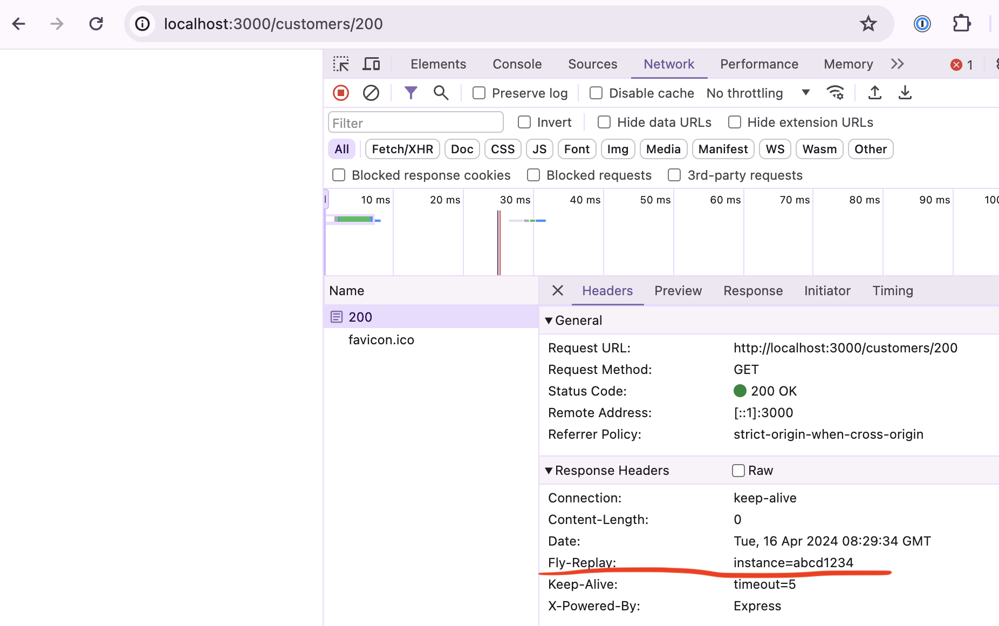

# Multi-tenant apps with single-tenant SQLite databases in global Tigris buckets

See the accompanying [blog post](https://fly.io/javascript-journal/single-tenant-sqlite-in-tigris/).

This is an example Vanilla JS app that demonstrates a multi-tenant application built on top of single-tenant SQLite databases, running on single-tenant Fly Machines and stored in globally distributed Tigris. It also showcases how to leverage the Dynamic Request Routing (the `fly-replay` HTTP header) in conjunction with Machines metadata to route the traffic between Machines.

The following sections show how to:
* set up Tigris,
* run the app locally,
* deploy and run the app to Fly.io,
* query DNS to find Machines by the Metadata.

To get started, clone this repository.

- [Multi-tenant apps with single-tenant SQLite databases in global Tigris buckets](#multi-tenant-apps-with-single-tenant-sqlite-databases-in-global-tigris-buckets)
  - [Tigris setup](#tigris-setup)
  - [Running locally](#running-locally)
  - [Deploying to Fly.io](#deploying-to-flyio)
  - [(Extra) Metadata-based DNS queries](#extra-metadata-based-dns-queries)

## Tigris setup

Issue `fly storage create` to create a Tigris project. This will output a bunch of environment variables that have to be available in the current shell and then at Fly Machines to run the app locally and at Fly.io respectively.

> This command will prompt you to log in or sign up to Fly.io

To run the app locally, either export the variables in the shell you will be running the app

```shell
export AWS_ACCESS_KEY_ID=<you-access-key-id>
export AWS_ENDPOINT_URL_S3=https://fly.storage.tigris.dev
export AWS_REGION=auto
export AWS_SECRET_ACCESS_KEY=<your-secret-access-key>
export BUCKET_NAME=<your-bucket-name>
```

or install a tool like [dotenv](https://direnv.net/) and put the exports into a `.envrc` file. `dotenv` will make the variables available for the shell commands run inside the current directory.

## Running locally


1. Install dependencies and start the server: `npm install && CUSTOMER_ID=100 npm run start`
3. Visit the URL http://localhost:3000/customers/100 and note the counter incrementing on a page refresh
4. Visit a URL for an "unknown customer" (e.g: http://localhost:3000/customers/200) and note the `fly-replay` header in the response
   
   * It contains a fabricated `machineId` (`"abcd1234"`), but when deployed to Fly.io it will become an actual machine ID to route the request to
   * To learn more check the corresponding section in the [blog post](https://fly.io/javascript-journal/single-tenant-sqlite-in-tigris/) or the docs on the [Dynamic Request Routing](https://fly.io/docs/networking/dynamic-request-routing/#)
5. Shut down the app (e.g. with `Ctrl+C`), remove the DB file (`rm db.sqlite3`) and start it again - note the counter picked up where it left off
   * the logs should indicate that we sent the database file to Tigris and then fetched it on the shutdown and startup respectively


## Deploying to Fly.io

1. Set up the app name in the [`fly.toml`](./fly.toml): `app = '<app-name>'`.
2. Create the app at Fly.io: `fly apps create <app-name>` (from now on all the `fly ...` commands will be using the `<app-name>` from the `fly.toml` file).
3. Allocate IPv4 for the app: `fly ips allocate-v4 --shared`.
4. Set up the app secrets:
    ```
    fly secrets set AWS_ACCESS_KEY_ID=$AWS_ACCESS_KEY_ID
    fly secrets set AWS_SECRET_ACCESS_KEY=$AWS_SECRET_ACCESS_KEY
    ```
5. Run machines for customers `100`, `200`, and `300`:
    ```shell
    for i in `seq 1 3`; do
        fly machine run . --name customer${i}00 --port 443:3000/tcp:http:tls \
        --env CUSTOMER_ID=${i}00 \
        --env AWS_REGION=$AWS_REGION \
        --env AWS_ENDPOINT_URL_S3=$AWS_ENDPOINT_URL_S3 \
        --env BUCKET_NAME=$BUCKET_NAME \
        --metadata customer_id=${i}00
    done
    ```
6. Visit the customers' pages while observing the logs with `fly logs`
  * `https://<app-name>.fly.dev/customers/100`
  * `https://<app-name>.fly.dev/customers/200`
  * `https://<app-name>.fly.dev/customers/300`

    Note that some requests are _replayed_ to their corresponding machines. Refer to the [blog post](https://fly.io/javascript-journal/single-tenant-sqlite-in-tigris/) for more details.

7. Destroy the machines
   > The following snippet uses [jq](https://jqlang.github.io/jq/)
    ```shell
    for m in `fly machines list -j | jq -r '.[].id'`; do
      fly machines destroy -f $m;
    done
    ```

## (Extra) Metadata-based DNS queries

> This section demonstrates how to get a Machine ID based on its `CUSTOMER_ID` metadata value that is set on a Machine start (with the `--metadata`). This mechanism is used in the app to route the requests to the corresponding Machines (e.g.: `https://<app-name>.fly.dev/customers/300` should be routed to the customer `300` Machine). Refer to the [blog post](https://fly.io/javascript-journal/single-tenant-sqlite-in-tigris/) for more details.

1. Grab one of the Machine's shells with `fly ssh console`.
2. Get a DNS AAAA record of the customer `300` Machine:

    ```
    dig aaaa +short 300.customer_id.kv._metadata.jts.internal
    # example response: fdaa:6:32a:a7b:23c8:3d9b:fe49:2
    ```
3. Get a Machine ID with a reverse DNS lookup:

    ```
    dig +short -x fdaa:6:32a:a7b:23c8:3d9b:fe49:2
    # example response: 3d8dd15c1ed778.vm.jts.internal.
    ```

